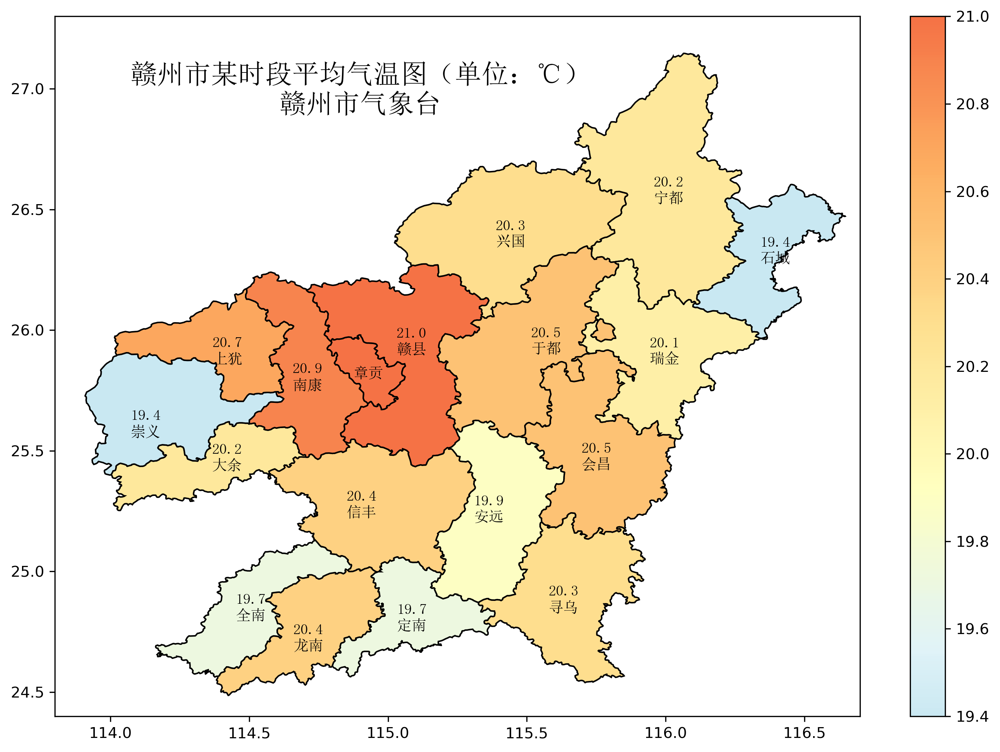

# gzmap
自定义的库,主要服务于赣州市气象台，默认使用赣州作为底图，并以此为基础绘图。

## 安装
尚未发布pypi，等待后续完善再上传，一旦上传，可以使用pip安装：
```
pip install gzmap
```

## 快速上手
下面仅展示一些简单例子，更多用法正在研发。

### 绘制基于站点的热力图
当计算了某候的平均气温之后，要将其呈现，可以参考如下代码：

Step1：导入基本库
```python
import matplotlib.pyplot as plt
import pandas as pd
from gzmap import GZMap
```

Step2：设置标题并读取表格数据
```python
title = f"赣州市某时段平均气温图（单位：℃）\n赣州市气象台"
df = pd.read_excel("demo/test_data.xlsx", skiprows=1, index_col=0)
df.index = [d[:2] for d in df.index]
```
Step3：创建画布并绘图
```python
plt.figure(figsize=(12, 8.4))
m = GZMap(font="simsun.ttc")
m.station_heat(df.index, df.values, fmt=".1f")
m.title(title)
```
Step4：保存图片并展示
```python
plt.savefig("test_im1.png", dpi=300, bbox_inches="tight")
plt.show()
```


## 联系作者
邮箱：1439731362@qq.com
